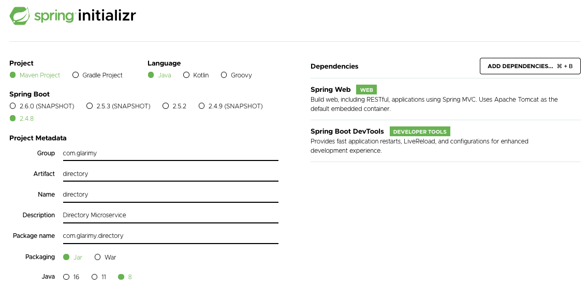

# Spring Boot Microservices #

1. Generate, download and extract `maven` project

```
https://start.spring.io/
```



2. Import the project into IDE and add `finalName` to the `pom.xml`

```
<?xml version="1.0" encoding="UTF-8"?>
<project xmlns="http://maven.apache.org/POM/4.0.0"
	xmlns:xsi="http://www.w3.org/2001/XMLSchema-instance"
	xsi:schemaLocation="http://maven.apache.org/POM/4.0.0 https://maven.apache.org/xsd/maven-4.0.0.xsd">
	<modelVersion>4.0.0</modelVersion>
	<parent>
		<groupId>org.springframework.boot</groupId>
		<artifactId>spring-boot-starter-parent</artifactId>
		<version>2.4.8</version>
		<relativePath /> <!-- lookup parent from repository -->
	</parent>
	<groupId>com.glarimy</groupId>
	<artifactId>directory</artifactId>
	<version>0.0.1-SNAPSHOT</version>
	<name>directory</name>
	<description>Directory Microservice</description>
	<properties>
		<java.version>1.8</java.version>
	</properties>
	<dependencies>
		<dependency>
			<groupId>org.springframework.boot</groupId>
			<artifactId>spring-boot-starter-web</artifactId>
		</dependency>

		<dependency>
			<groupId>org.springframework.boot</groupId>
			<artifactId>spring-boot-devtools</artifactId>
			<scope>runtime</scope>
			<optional>true</optional>
		</dependency>
		<dependency>
			<groupId>org.springframework.boot</groupId>
			<artifactId>spring-boot-starter-test</artifactId>
			<scope>test</scope>
		</dependency>
	</dependencies>

	<build>
		<finalName>glarimy-directory</finalName>
		<plugins>
			<plugin>
				<groupId>org.springframework.boot</groupId>
				<artifactId>spring-boot-maven-plugin</artifactId>
			</plugin>
		</plugins>
	</build>

</project>

```

3. Edit the DirectoryApplication.java

```
package com.glarimy.directory;

import org.springframework.boot.SpringApplication;
import org.springframework.boot.autoconfigure.SpringBootApplication;
import org.springframework.web.bind.annotation.GetMapping;
import org.springframework.web.bind.annotation.RequestParam;
import org.springframework.web.bind.annotation.RestController;

@SpringBootApplication
@RestController
public class DirectoryApplication {

	public static void main(String[] args) {
		SpringApplication.run(DirectoryApplication.class, args);
	}
	
	@GetMapping("/hello")
	public String hello(@RequestParam(value="name", defaultValue = "World") String name) {
		return String.format("Hello %s", name);
	}

}
```

4. Build and run the project

```
mvn clean package
```
```
java -jar target/glarimy-directory.jar
```

5. Verify the API


```
curl http://localhost:8080/hello
```

```
curl http://localhost:8080/hello?name=Krishna
```